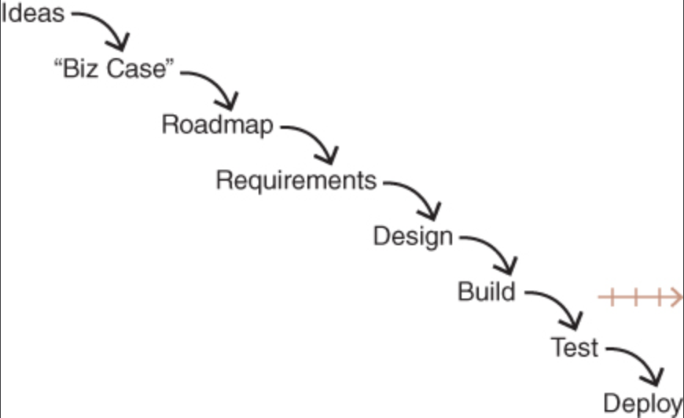

# Preface
- `It doesn't matter how good your engineering team is if they aren't given something worthwhile to build`
- `The state of the art is very different from the state of the practice`

# Chapter 1
## Behind Every Great Product
- Behind every great product there is someone who works non-stop, leading the team to combine tech and design to solve customer problems
  - Often a product manager, startup co-founder, or CEO
  - Sometime someone else who just saw a need
- The product management role is very different than design, engineering, marketing, or project manager roles

# Chapter 2
## Technology-Powered Products and Services
- This book focuses on products that are powered by tech
  - Ex: Apps, E-commerce platforms, social media, business services, etc.

# Chapter 3
## Startups: Getting to Product/Market Fit
- Companies fall into three stages
  - Startups, growth-stage, and enterprise companies
- New product company that hasn't yet found a product/market fit
- Ie. Still trying to find a product capable of centering a business around
- Product manage role is usually filled by one of the co-founders
- Less than 25 engineers and upto four or five product teams
- Companies at this stage are in a race to find product/market fit before they run out of money
  - This means a huge focus on product is needed
  - Early funding is meant to allow the startup to figure out if it can find a product/market fit
- Successful startups are usually the ones that are really good at product discovery

# Chapter 4
## Growth-Stage Companies: Scaling to Success
- Startups that find product/market fit now need to grow and scale their business
- Increased hiring, new products and services, and grow the core business as quickly as possible
- Between 25 and a couple hundred engineers
- The struggles at this point are of a different nature
  - Product teams have trouble understanding how their work contributes to the bigger picture
  - Sale and marketing complain that the strategies used for the first product won't work as well for the new product(s)
  - Engineers complain about technical debt due to decisions that were made in order to get the first product working
- Leaders may struggle because the styles and techniques that worked early on may not work well anymore
  - Roles and behaviors often change at this point
- Motivation is strong because an IPO or aqcuisition are possible
  - Also there is huge potential to have an impact on the world

# Chapter 5
## Enterprise Companies: Consistent Product Innovation
- After going through the growth state, companies still need to innovate with the product(s) they offer
  - Not just tweak and optimize existing products (called `value capture`)
  - Must develop each product to its full potential
- Death of enterprise companies is slow
  - Starts to happen when the company only leverages the value and brand it had create years or decades earlier
  - Often happens once the company is publicly traded
  - So many stateholders to the point that exciting new initiatives or ventures are shut down because it could jeopardize the core business
  - Could also come from too many obsticles to make it worth people's effort to revitalize the business
- Symptoms are clear
  - Lower morale, lack of innovation, and taking more time to launch products
- The company has likely achieved the mission it had as a startup and people don't know what's next
- People in different roles now complain about different things
  - **Product** teams complain about lack of vision, empowerment, and that it takes too long for decisions to be made
  - **Leadership** is frustrated by the lack of innovation from the product teams
    - This leads them to acquire other companies or setup innovation labs which usually don't give them what they want

# Chapter 6
## The Root Causes of Failed Product Efforts
- Companies use a flawed approach to creating new products

- `Ideas` come from either inside the companie or outside
  - Ex: Inside the company may be from executives, key stakeholders, or business owners
  - Ex: Outside the company may be from current or prospective customers
- Ideas are then prioritized into a `roadmap`
  - First reason: Get teams to work on the most important thing first
  - Second reason: Predict when things will be ready
  - Leadership will then hold a quarterly or annual planning session
    - Product roadmap is negotiated during this time
    - Sounds like the t-shirt sizing stuff that just happened at Tendo
  - They'll also determine a `business case` for each item
    - This answers two questions: `1. How much will it make?` and `2. How much will it cost?`
- Once the roadmap is done the product manage will talk to stakeholders to determine the `requirements`
  - Could be user stories or functional
- The requirements are given to the `design` team
- Designs are given to the engineers to `build` the product
  - Usually where agile workflows are introduced
- The product then goes to QA for `testing`
  - Ideally testing happens throughout development
  - QA ensure the product works as advertised and doesn't result in other problems (called `regressions`)
- Once QA approves the product is `deployed` and available to customers

- This is how most companies work, while complaining about the lack of innovation
- While engineers might be following as much of an *agile workflow* as they can, the overall process is more *waterfall*

### Problems This Process
1. The source of ideas
  - Leads to sales-driven specials and stakeholder-driven products
  - Lack of team empowerment
    - Teams are really just there to implement what they're told
2. While finding business casesfor ideas is generally good, the way they are found in order to define a prioritized roadmap is bad
  - The two key questions `what will it cost?` and `what will it make?` are impossible to answer at this stage because they both depend on how good the solution is
    - One of the biggest lessons is `knowing what we can't know` and at this stage we can't know the answer to either of these two questions
  - Because there isn't yet a defined solution engineering teams can't accurately give estimates for how much effort will be needed
    - They are often pushed into doing T-Shirt excersises to get an answer
3. The roadmap is for everyone other than the teams actually solving the problem and building the product
  - Ex: Marketing wants a feature for a campaign, sales wants a feature for a customer, etc.
  - There are two truths about product
    1. At least half the ideas on a roadmap aren't going to work
      - Really good teams assume at least three quarters of the ideas won't work
    2. With the remaining ideas that do have potential, it usually takes serveral iterations before they're able to deliver the necessary business value
      - Called `time to money`
4. This really isn't product management, but rather project management
  - All that's happening is the gathering and documenting of requirements for engineers
  - Full 180 away from product management
5. Too late to get the real benfit from designers
  - `Lipstick on the pig` model where we have something ugly and we're trying to make it look presentable
6. Engineers get brought it too late
  - Engineers are usually the best single source of innovatio
  - If you're not bringing your engineers to the party you missing out on half their value
7. Agile principles and benefits are brough in too late
  - This only uses Agile for the delivery portion of the process
  - The rest of the org is not Agile
8. Everything is project based instead of product based
  - The company fund, staff, pushes, and launches projects
  - Projects are a type of output, where as product is about outcome
  - Leads to abandoned projects
9. Customer validation happens too late (at or towards the end)
  - One of the biggest risks is building releasing something and finding out that it wasn't what was needed
  - This is one of the more expensive processes to come up with new products
10. The biggest loss is in the oppertunity cost

# Chapter 7
## Beyond Lean and Agile
- There is no silver bullet to create products, whether or not you want to believe this is irrelivent, as you'll figure it out one way or another
- While the way lean and agile are implemented may be different and change across teams, the core principles are here to stay
- Many teams claim to follow Lean principles, yet they spend months working towards an MVP which they don't know if it will sell
  - Alternatively they test everything and end up moving too slow
- The best product teams do Lean and Agile differently
  1. Risks are address before anything gets built
    - `Value risk` will customers buy it
    - `Usability risk` can customers figure out how to use it
    - `Feasibility risk` can we actually build what we're thinking about
    - `Business viability risk` Does this solution work for other parts of our business (sales, marketing, finance, legal, etc.)
  2. Products are defined *collaboratively*
    - No more product manager defining the requirements, then the designer designs the product that fulfills the requirements, and lastly the engineer builds the product to implement what the designer put together
    - Everyone works side-by-side in a give-and-take fashion to build something that customers will love
  3. Focus on solving problems, not implementing features
    - Roadmaps are all about output
    -  The focus should be on business results via solutions that address the underlying problem(s)

# Chapter 8
## Key Concepts
- These concepts are referred to throughout the book and are foundational to modern product work

### Holistic Product
- The term `product` in this modern world doesn't just refer to features of the physical/digital product that the customer is using
  - Instead it refers to everything invloved in delivering the business value that solves the problem
- Ex: Consider Amazon.com, the product being delivered is not limited to features offers by the website, but also the design of the website, the experience of buying or returning something, etc. Note that the physical products sold by vendors through Amazon.com are not included in the product that is Amazon.com.

### Continuous Discovery and Delivery
- Two high-level things all product teams must do
  1. Discover the product we will build
  2. Deliver that product to customers
- Discovery and delivery happen in parallel
  - Discovery is the primary task of both the product manager and the designer
  - The engineers mostly work on the delivery part
  - There is cross over, the designers and product manager provide clarification to engineers on the intended behavior while the engineers may help with tech perspective on the discovery process

### Product Discovery
- This is where we address all the possible risks before building anything
  - As a result, it is important that all disciplines are invloved (product, design, and engineering)
- Quickly determine which ideas are good and which are bad
- The output of discovery is a `validated product backlog`
- Requires answers to four critical questions
  1. Will the user buy or use this?
  2. Can the user figure out how to user this?
  3. Can our engineers build this?
  4. Can our stakeholders support this?

### Prototypes
- Use prototypes to run experiments on ideas rather building out an entire product
  - Less time and money required
- There are different types of prototypes for different risks and situations
- Strong product teams usually test 10 - 20 (or more) product ideas each week
- Prototypes are not production ready products, they are simply an inexpensive way to help a company or product team validate or invalidate ideas quickly

### Product Delivery
- Prototypes are meant to show that an idea is worth pursuing and can be delivered to customers
  - Ie: The necessary scale, performance, reliability, fault tolerance, security, privacy, internationalization, and localization have been performed and the product works as advertised
- The goal of the delivery process is to build and ship a production-quality tech product

### Products and Product/Market Fit
- The smallest possible product that will meet the needs of a given market of customers
- These are actual products that are the output of the delivery process
- While the discovery process determine the product that needs to be built, it is the delivery process that actually builds, test, and releases the product

### Product Vision
- Product vision is the long-term view of the product
  - Generally 2 - 10 years into the future
- Views of a product by time duration
  - Prototype are quick short-term experiments during discovery
  - Product is the result of building the final product that was thought up during discovery in order to achieve product/market fit
  - Product vision the overarching quide to what is worked on and the discovery and build process work towards delivering that vision

### MVP
- Term `MVP` was first coined in 2001 by Eric Robinson and made popular by Eric Ries in his 2011 book *The Lean Startup*
- Often teams spend months building an MVP
  - Teams could learn the same stuff in a matter of days or sometimes even hours
- The confusion comes from the letter *P* (Product)
  - Teams take this word to mean that they should release an actual product. In other words, a really solution that can be sold and that a business can be run on
  - The MVP should be a *Prototype* and not a product
- Building an actual product to learn from is a waste of time and money and is also the opposite of **Lean**
- Usuing the term *prototype* for work-in progress and *product* for finished deliverables is clearer to teams members, leadership, the company as a whole, and customers